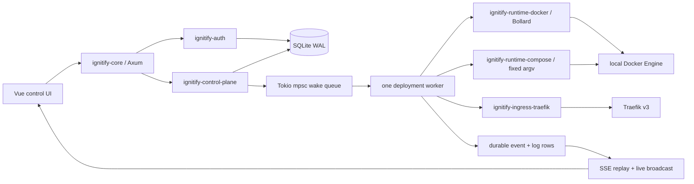
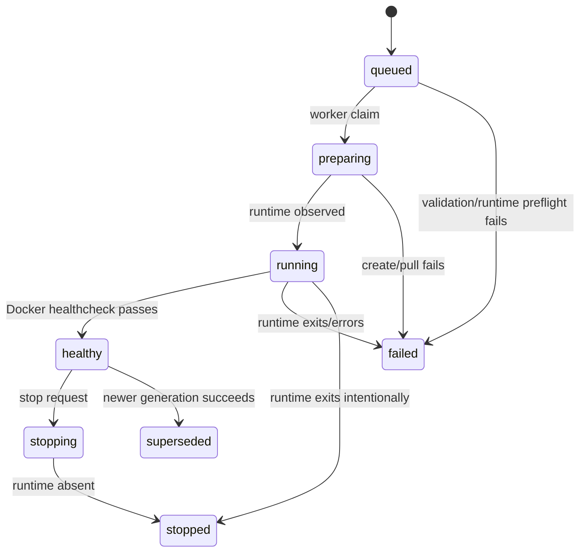

# Design: Ignitify Core Platform

## Summary

Ignitify becomes a Linux single-host Docker PaaS first: authenticated users create projects, receive one `production` environment, configure image services, then submit durable deployments. Axum only validates and submits desired state. A bounded Tokio worker owns Docker effects, observed-state updates, logs, retries, and reconciliation.

Traefik v3 remains ingress. It owns TLS and proxying through platform-generated labels, a fixed proxy network, persistent ACME state, and a restricted read-only Docker API path. SQLite in WAL plus `FULL` synchronous mode remains source of truth until a real multi-host or HA requirement needs Postgres.

## Decisions

| Decision | Chosen design | Evidence / reason |
|---|---|---|
| Deployment scope | Image service first, then hardened Compose service. Both share project, environment, service, deployment, event, and domain model. | Image and Compose have materially different security/runtime behavior; research requires separate adapters: `research:39-45`, `research:94-107`. |
| Host model | One Linux Docker Engine host. No SSH, remote agent, Swarm, Docker Desktop, or Kubernetes in this design. | Existing server binds one local process and only SQLite exists: `crates/ignitify-core/src/main.rs:201-235`, `crates/ignitify-db/src/lib.rs:44-68`. |
| Authorization | Global `admin` bypasses ownership. Non-admin access comes only from `project_members` role `owner`, `editor`, or `viewer`. Missing membership returns `404`; it does not reveal project existence. | Current `AuthenticatedUser` has admin/user only and no tenant implementation: `crates/ignitify-auth/src/lib.rs:34-49`, `crates/ignitify-auth/src/lib.rs:344-352`. Project authorization must exist before project resources. |
| Project bootstrap | Creating a project transactionally creates one `production` environment and owner membership. Environment CRUD waits. | This proves hierarchy without an empty-environment workflow. Existing UI already presents project detail tabs but all data is fixture state: `frontend/src/views/ProjectDetailView.vue:24-100`. |
| Deletion | Project/service deletion is deferred. Stop and redeploy are explicit lifecycle actions first. Domain removal requires confirmation in UI and queues reconciliation. | Deleting runtime resources must stop containers and routes safely. No deletion behavior exists today. |
| Service configuration | `services.kind` supports `image` and `compose`; Phase 1 UI/API accepts only immutable OCI image references with `@sha256:` digest. Service config is JSON validated by `ignitify-domain`. | A tag cannot guarantee immutable rollback. Compose is delayed until its policy boundary exists: `research:242-257`. |
| Secrets | Encrypt every service variable at rest using one private `AgeCipher` implementation in control plane. It requires `IGNITIFY_SECRETS_AGE_IDENTITY`; ciphertext lives in SQLite. Secret values never enter logs, events, labels, or normal GET responses. External KMS replaces this later. | Research recommends external KMS eventually and `age` only for MVP: `research:214-230`. A private implementation avoids premature provider abstraction. |
| Deployment acceptance | `POST` stores immutable deployment snapshot plus `queued` event transactionally, then wakes worker and returns `202`. A full periodic/startup scan makes mpsc loss or full queue non-fatal. | HTTP handlers must not do Docker work: `research:123`, `research:169-180`. |
| Concurrency | One worker command at a time for first host. Database claim prevents two active generations for one service. Repeat idempotency key returns same deployment; new key while active returns `409`. | Dokploy lesson and research requirement: per-service serialization / per-host bound: `research:39-45`, `research:161-167`. |
| Runtime status | Desired state and observed state stay distinct. Worker only records `running` or `healthy` after Docker inspect; Docker health becomes `healthy` only when image/service declares a passing exec health check. | Never infer runtime state from request success: `research:161-167`. |
| Ingress | Traefik v3 Docker provider, `exposedByDefault=false`, ownership constraint, `ignitify-proxy` network, platform labels only, one root hostname per domain. No path prefixes, wildcard domains, user middleware, raw Traefik labels, or manual cert upload. | Traefik selected in research: `research:182-203`. Label ownership and restricted Docker access are external best practice. |
| Realtime | SSE over authenticated `fetch`, not native `EventSource`, because access JWT is memory-only and native EventSource cannot send `Authorization`. Durable records use sequence cursor; live broadcast only reduces latency. | Current bearer is added by `apiFetch` and refresh cookie path is auth-only: `frontend/src/lib/api/core.ts:155-205`, `crates/ignitify-core/src/main.rs:158-167`. |
| Compose policy | Canonicalize through fixed `docker compose config --format json`; Rust does bounded YAML preflight and policy validation. Never use incomplete Rust Compose structs as semantic authority. | Compose research: `research:242-257`; Docker Compose canonicalization source in References. |
| SQLite durability | Set `foreign_keys=ON`, `journal_mode=WAL`, `synchronous=FULL`, and `busy_timeout=5000`. Keep in-memory test database single connection. | Current DB only enables foreign keys: `crates/ignitify-db/src/lib.rs:44-68`. Deployment state must prefer correctness over marginal write throughput. |
| UI ownership | Views become thin. Resource data/actions move into `useProjects`, `useProject`, `useDeploymentStream` named composables and domain API modules. | Existing views are hard-coded fixtures: `frontend/src/views/ProjectsView.vue:6-34`, `frontend/src/views/ProjectDetailView.vue:24-100`. Existing frontend uses Composition API and named preferences composable: `frontend/src/layouts/MainLayout.vue:1-11`. |

## Architecture



### Crate Boundaries

```text
ignitify-core
  Axum composition root. HTTP auth extraction, request validation, JSON/SSE adapters,
  environment config, app health. No Docker or Traefik client types in handlers.

ignitify-domain
  IDs, validated project/environment/service/domain/deployment models, deployment state
  transition rules, input errors. No SQL, Axum, Docker, Traefik, filesystem, or crypto.

ignitify-control-plane
  Deployment submission, encrypted variable snapshotting, queue wake-up, worker,
  reconciliation, lifecycle/log event emission, runtime and ingress ports. No SQL strings,
  Axum, Bollard types, Compose CLI, or raw Traefik labels.

ignitify-runtime-docker
  Bollard adapter for image pull/create/start/inspect/stop/remove/logs. Owns Docker API
  translation, deterministic names, restricted container settings, and runtime errors.

ignitify-ingress-traefik
  Validated domain -> platform label rendering, proxy network invariants, Traefik health
  translation. It returns platform-owned labels only; it never receives raw tenant labels.

ignitify-runtime-compose
  Bounded YAML preflight, staging directory, controlled env materialization, canonical
  Compose JSON validation, fixed argv execution, Compose status/log collection.

ignitify-db
  SQLx migrations, SQLite repositories, transactions, encrypted variable blobs, immutable
  deployment snapshots, durable event/log cursors, and read models.
```

Dependency direction:

```text
ignitify-core -> ignitify-auth, ignitify-db, ignitify-domain, ignitify-control-plane
ignitify-auth -> ignitify-db
ignitify-control-plane -> ignitify-domain, ignitify-db
ignitify-runtime-docker -> ignitify-domain, ignitify-control-plane runtime port
ignitify-runtime-compose -> ignitify-domain, ignitify-control-plane runtime port
ignitify-ingress-traefik -> ignitify-domain, ignitify-control-plane ingress port
```

`ignitify-core` may construct adapter values during startup, but handlers do not call Docker/Compose/Traefik directly. Keep `AppState` as composition data:

```rust
#[derive(Clone)]
struct AppState {
    auth: Arc<AuthService>,
    database: Database,
    control: ControlHandle,
    secure_cookies: bool,
}
```

`Database` remains cloneable today: `crates/ignitify-db/src/lib.rs:39-42`. Clone it before constructing `AuthService`; current startup moves the only handle into auth at `crates/ignitify-core/src/main.rs:203-220`.

### Domain Rules

#### Hierarchy

```text
User --< ProjectMember >-- Project --< Environment --< Service --< Deployment
                                                     Service --< Domain
                                                     Service --< ServiceVariable
```

- `ProjectMember.role`: `owner`, `editor`, `viewer`.
- `owner`: update project, create/update service and variables, deploy, stop, change domains.
- `editor`: create/update service and variables, deploy, stop, view domains/logs.
- `viewer`: read-only project, service, deployment, domain, event, and log access.
- global `admin`: all project actions. It does not become a project member automatically.
- First project owner is requesting user. Admin may create a project owned by self only in this scope.
- Project name length: `1..=100`, trimmed, no control characters. Environment/service names: `1..=64`, ASCII lower-case DNS-label subset for service names. IDs are UUID strings and all Docker/Traefik names derive from IDs, never display names.
- Every project gets one immutable default environment named `production`. Environment create/rename/delete is deferred.
- An image service requires: name, digest-pinned image reference, optional entrypoint/command argv, optional internal TCP port `1..=65535`, optional exec-form healthcheck, and variables.
- `image_reference` must contain `@sha256:`. Tags, build contexts, local paths, and `latest` are rejected.
- A Compose service is stored only after Slice 6 policy passes. It requires compose YAML, selected exposed service, and optional internal port/domain.

#### Deployment State Machine



Terminal states: `healthy`, `failed`, `stopped`, `superseded`.

Rules:

1. Deployment snapshot has service desired spec, encrypted variable map, actor ID, immutable image digest, target generation, and idempotency key.
2. `queued` insertion and its first event share one database transaction.
3. Worker performs compare-and-claim. Only `queued -> preparing` succeeds. Repeated wake signals are harmless.
4. One service cannot have two `queued|preparing|running` deployments. Same idempotency key returns original response; a distinct key returns `409 active deployment exists`.
5. Worker reads Docker inspect after every uncertain operation before retrying. Docker/API errors do not imply failure until observed state says so.
6. Startup and 30-second periodic reconciliation scan nonterminal deployments. Docker events wake scans but are never durable truth.
7. Rollback creates a new generation from an earlier immutable deployment snapshot. It never mutates history.
8. Runtime object garbage collection only removes objects with `com.ignitify.managed=true` and matching opaque service ID.

### Persistence Model

#### Migration `0002_workspace.sql`

```text
projects
  id TEXT PK
  name TEXT NOT NULL
  owner_id TEXT NOT NULL FK users(id)
  created_at TEXT NOT NULL
  updated_at TEXT NOT NULL

project_members
  project_id TEXT NOT NULL FK projects(id) ON DELETE CASCADE
  user_id TEXT NOT NULL FK users(id) ON DELETE CASCADE
  role TEXT NOT NULL CHECK owner|editor|viewer
  created_at TEXT NOT NULL
  PRIMARY KEY (project_id, user_id)

environments
  id TEXT PK
  project_id TEXT NOT NULL FK projects(id) ON DELETE CASCADE
  name TEXT NOT NULL
  is_default INTEGER NOT NULL CHECK is_default IN (0, 1)
  created_at TEXT NOT NULL
  updated_at TEXT NOT NULL
  UNIQUE(project_id, name COLLATE NOCASE)

indexes
  projects(owner_id, updated_at DESC)
  project_members(user_id, project_id)
  environments(project_id, is_default)
  UNIQUE environments(project_id) WHERE is_default = 1
```

Create project, owner membership, and default `production` environment in one transaction. `projects` are update-only in this design; no hard delete route yet.

#### Migration `0003_services.sql`

```text
services
  id TEXT PK
  environment_id TEXT NOT NULL FK environments(id) ON DELETE CASCADE
  name TEXT NOT NULL COLLATE NOCASE
  kind TEXT NOT NULL CHECK image|compose
  desired_spec_json TEXT NOT NULL
  desired_generation INTEGER NOT NULL DEFAULT 1
  desired_state TEXT NOT NULL CHECK running|stopped
  created_at TEXT NOT NULL
  updated_at TEXT NOT NULL
  UNIQUE(environment_id, name)

service_variables
  id TEXT PK
  service_id TEXT NOT NULL FK services(id) ON DELETE CASCADE
  key TEXT NOT NULL
  is_secret INTEGER NOT NULL CHECK is_secret IN (0, 1)
  ciphertext TEXT NOT NULL
  created_at TEXT NOT NULL
  updated_at TEXT NOT NULL
  UNIQUE(service_id, key)

indexes
  services(environment_id, updated_at DESC)
  service_variables(service_id, key)
```

`desired_spec_json` remains schema-flexible but never unvalidated: deserialize it into `ignitify_domain::ServiceSpec` at repository boundaries. `ciphertext` uses armored age text. All values are encrypted, including non-secret variables; only non-secret values return from authorized detail endpoints.

#### Migration `0004_deployments.sql`

```text
deployments
  id TEXT PK
  service_id TEXT NOT NULL FK services(id) ON DELETE CASCADE
  generation INTEGER NOT NULL
  idempotency_key TEXT NOT NULL
  requested_by_user_id TEXT NOT NULL FK users(id)
  spec_json TEXT NOT NULL
  variables_ciphertext TEXT NOT NULL
  runtime_ref TEXT
  status TEXT NOT NULL CHECK queued|preparing|running|healthy|failed|stopping|stopped|superseded
  failure_reason TEXT
  created_at TEXT NOT NULL
  started_at TEXT
  finished_at TEXT
  UNIQUE(service_id, generation)
  UNIQUE(service_id, idempotency_key)

deployment_events
  sequence INTEGER PRIMARY KEY AUTOINCREMENT
  deployment_id TEXT NOT NULL FK deployments(id) ON DELETE CASCADE
  kind TEXT NOT NULL
  payload_json TEXT NOT NULL
  created_at TEXT NOT NULL

deployment_logs
  sequence INTEGER PRIMARY KEY AUTOINCREMENT
  deployment_id TEXT NOT NULL FK deployments(id) ON DELETE CASCADE
  stream TEXT NOT NULL CHECK stdout|stderr|system
  line TEXT NOT NULL
  created_at TEXT NOT NULL

indexes
  deployments(service_id, created_at DESC)
  deployments(status, created_at)
  deployment_events(deployment_id, sequence)
  deployment_logs(deployment_id, sequence)
```

#### Migration `0005_domains.sql`

```text
domains
  id TEXT PK
  service_id TEXT NOT NULL FK services(id) ON DELETE CASCADE
  hostname TEXT NOT NULL COLLATE NOCASE UNIQUE
  status TEXT NOT NULL CHECK pending|active|failed
  last_error TEXT
  created_at TEXT NOT NULL
  updated_at TEXT NOT NULL

indexes
  domains(service_id)
```

Hostname rules: lowercase ASCII FQDN only, no wildcard, no scheme, no slash, no port, no path, `localhost`, private IP, or public suffix-only hostname. IDNA and path routing are explicit later work.

Extend `audit_logs` with nullable `resource_type`, `resource_id`, and `details_json` so mutations record actor + target without serializing variables/secrets.

### API Contract

All non-auth routes live below `/api/v1`. Browser mutations always send `X-Ignitify-Request: 1`; core validates this and an allowed `Origin` when present. Refactor current `ApiError(AuthError)` at `crates/ignitify-core/src/main.rs:37-64` into an API enum mapping auth/domain/control/database errors without leaking server details.

Centralize authenticated extraction rather than duplicating current `/auth/me` logic at `crates/ignitify-core/src/main.rs:131-137`:

```rust
async fn require_actor(state: &AppState, headers: &HeaderMap)
    -> Result<AuthenticatedUser, ApiError>;
```

Project-scoped repository lookup performs membership authorization. A missing or unauthorized resource is `404`; malformed input is `400`; role failure is `403`; duplicate natural name, hostname, or active deployment is `409`; accepted deployment is `202`.

| Method and route | Contract | Slice |
|---|---|---|
| `GET /projects` | List projects accessible to actor with default environment and service/deployment summary. | 1 |
| `POST /projects` | Create project, owner membership, default production environment. | 1 |
| `GET /projects/:project_id` | Return project, environments, services, latest deployment summary. | 1 |
| `PATCH /projects/:project_id` | Rename project. | 1 |
| `GET /projects/:project_id/services` | List services for default environment. | 2 |
| `POST /projects/:project_id/services` | Create image service plus encrypted variables. | 2 |
| `GET /services/:service_id` | Authorized service config; secrets only return key + `is_set`. | 2 |
| `PATCH /services/:service_id` | Update desired image spec/variables; increments desired generation. | 2 |
| `POST /services/:service_id/deployments` | Require `Idempotency-Key`, snapshot desired spec/variables, return deployment `202`. | 3 |
| `GET /services/:service_id/deployments` | Paginated deployment history. | 3 |
| `GET /deployments/:deployment_id` | Deployment state, failure reason, current event cursor. | 3 |
| `POST /deployments/:deployment_id/rollback` | Create a new deployment from this immutable snapshot. | 3 |
| `POST /services/:service_id/stop` | Create stop command and return `202`. | 3 |
| `GET /services/:service_id/domains` | List managed root hostnames. | 4 |
| `POST /services/:service_id/domains` | Create hostname desired state and queue reconcile. | 4 |
| `DELETE /domains/:domain_id` | Remove route after explicit `{ "confirm_hostname": "..." }`; return `202`. | 4 |
| `GET /deployments/:deployment_id/events` | SSE lifecycle stream; accepts `Last-Event-ID` or `after` cursor. | 5 |
| `GET /deployments/:deployment_id/logs` | SSE log stream with independent cursor. | 5 |

Pagination uses opaque sequence or creation cursor; no unbounded `LIMIT/OFFSET` lists. Initial page default: 50 deployments, max: 100.

### Worker and Runtime Contract

`ControlHandle` has two jobs: durable submit/read model and best-effort worker wake. It is not an in-memory source of truth.

```rust
pub struct ControlHandle { /* database + mpsc::Sender<Wake> + broadcast */ }

impl ControlHandle {
    pub async fn submit_deploy(
        &self,
        actor: &AuthenticatedUser,
        service_id: ServiceId,
        idempotency_key: &str,
    ) -> Result<DeploymentRecord, ControlError>;

    pub async fn submit_stop(
        &self,
        actor: &AuthenticatedUser,
        service_id: ServiceId,
    ) -> Result<DeploymentRecord, ControlError>;
}
```

Submission steps:

1. Load authorized service + variables; validate desired `ServiceSpec` again.
2. Decrypt variables in control-plane memory, immediately encrypt immutable deployment map, and zero temporary buffers after use.
3. Transaction: insert deployment, append `deployment.queued`, append audit row.
4. `try_send(Wake::Deployment(id))`. Full/disconnected wake queue does not undo durable accepted work; periodic scan catches it.
5. Return row. API serializes `202 Accepted`.

Worker steps:

1. On start and every 30 seconds, query durable nonterminal rows and `queued` rows. A channel wake only accelerates this.
2. Atomically claim one valid queued deployment. With one worker, host concurrency is exactly one.
3. Append state event before/after external steps: pull, create, start, observe, route, stop, fail.
4. For image deployment, call Bollard only through `ignitify-runtime-docker`.
5. Inspect runtime after API timeout/error before retrying; use deterministic names and managed labels.
6. Write log batches to SQLite, commit, then broadcast same committed records. Bound each line to 16 KiB, retain latest 10,000 lines/deployment, and prune old terminal deployment logs/events after 30 days by scheduled maintenance query.
7. Publish committed records through bounded `tokio::sync::broadcast`; a lagged subscriber rereads SQLite from last sequence.
8. Stop requests remove runtime only after ownership label + service ID match. Successful newer deployment marks prior live deployment `superseded`.

Image runtime restrictions:

- `bollard` is first use in Slice 3, isolated to `ignitify-runtime-docker`.
- Docker host comes from `IGNITIFY_DOCKER_HOST`; default Linux Unix socket. Startup validates daemon ping only when runtime is enabled.
- Image references are digest-pinned and pulled before create.
- Names: `ignitify-svc-<service-uuid>-g<generation>`; labels use reverse-DNS namespace `com.ignitify.*`.
- No host ports, host networking, host PID/IPC/UTS namespaces, privileged mode, devices, Docker socket, arbitrary bind mounts, or user Docker labels.
- Fixed resource defaults: 1 CPU, 512 MiB memory, 256 PIDs, `no-new-privileges`; resource customization is deferred.
- Optional health check is Docker exec form (`CMD` argv), not a tenant shell string. If absent, observed running state is success; if present, only Docker `healthy` reaches `healthy`.

### Traefik Contract

Traefik configuration belongs in an operator-owned deployment artifact, not database rows written as ad hoc files.

Static settings:

```yaml
providers:
  docker:
    endpoint: tcp://docker-read-proxy:2375
    exposedByDefault: false
    constraints: "Label(`com.ignitify.managed`,`true`)"
    network: ignitify-proxy

certificatesResolvers:
  le:
    acme:
      storage: /letsencrypt/acme.json
```

Operational invariants:

- `ignitify-proxy` is fixed and owned by operator.
- Traefik receives only a private, verb-restricted Docker read API path. Socket `:ro` alone is insufficient; socket proxy or Docker AuthZ must deny mutation verbs.
- Engine-mutating worker remains host-side/private. Do not publish Docker socket proxy, Traefik API, or dashboard.
- ACME storage is persistent, mode `0600`, backed up encrypted, and tested against Let’s Encrypt staging before production resolver use.
- Traefik container uses fixed image digest, read-only root filesystem, no-new-privileges, dropped capabilities where compatible.
- Container labels must include `com.ignitify.managed=true`, service ID, deployment generation. Traefik constraint requires managed ownership in addition to `traefik.enable=true`.
- `ignitify-ingress-traefik` creates all `traefik.*` label values from validated opaque IDs, hostname, fixed entrypoint, fixed cert resolver, and service internal port.
- Tenant input never contains raw labels, router/service/middleware names, TLS options, Docker network names, or arbitrary ports.
- Route config changes recreate managed container because Docker labels are immutable. First version accepts a brief update window; blue/green/canary cutover is deferred.
- Domain status is `active` after route reconciliation and runtime inspection. It does not claim ACME issuance visibility that Traefik does not expose reliably.

Example generated labels, never user-provided:

```text
com.ignitify.managed=true
com.ignitify.service-id=<uuid>
com.ignitify.generation=42
traefik.enable=true
traefik.http.routers.ignitify-<uuid>.rule=Host(`<validated-hostname>`)
traefik.http.routers.ignitify-<uuid>.entrypoints=websecure
traefik.http.routers.ignitify-<uuid>.tls=true
traefik.http.routers.ignitify-<uuid>.tls.certresolver=le
traefik.http.services.ignitify-<uuid>.loadbalancer.server.port=8080
```

### SSE Contract

Use `fetch()` so frontend can send existing memory-only bearer token. Native `EventSource` is not used.

Backend algorithm:

1. Authenticate project access before reading cursor.
2. Parse `Last-Event-ID`, else query `after`, as a non-negative sequence.
3. Subscribe to broadcast first.
4. Read durable rows `sequence > cursor` through a stable maximum sequence; emit in ascending sequence.
5. Drain buffered live entries where sequence is greater than emitted maximum; deduplicate by sequence.
6. On `RecvError::Lagged`, reread SQLite from last emitted sequence.
7. Send `id`, `event`, and JSON `data`; send comment heartbeat every 15 seconds.
8. Set `Content-Type: text/event-stream`, `Cache-Control: no-store`, and `X-Accel-Buffering: no`. Do not add buffering middleware in Traefik path.
9. Cursor outside retention emits a `snapshot` event with current deployment read model and current sequence, then continues live.

Frontend `useDeploymentStream(deploymentId)` owns abort controller, reconnect backoff, sequence dedupe, and cleanup in `onUnmounted`. It uses `apiOpenEventStream()` in `frontend/src/lib/api/core.ts`, not the JSON parser in `apiFetch`. `ProjectDetailView` subscribes while deployment/log tab is visible. `MainLayout` remains free of resource polling/subscriptions.

## Vertical Slices

### Slice 1: Workspace Authorization and Real Projects

**Outcome:** authenticated actor can create, list, read, and rename own projects; each project has exactly one default `production` environment. UI replaces project fixtures with API data and a working New Project dialog.

**Backend and data changes:**

- Add `ignitify-domain` with UUID ID wrappers, `ProjectInput`, `ProjectSummary`, `ProjectMemberRole`, validation, and domain error type.
- Add workspace migration and repository modules under `ignitify-db`; configure WAL/FULL/busy timeout in `Database::connect`.
- Add `Database::projects()` and `Database::environments()` accessors. Repository methods accept actor ID/role or return membership record; they never trust route parameters alone.
- Refactor `AppState` to retain cloned `Database`. Add shared bearer extractor and API error enum. Retain auth route behavior unchanged.
- Add list/create/get/update project handlers. `POST` requires same-origin mutation header and transactionally creates project/member/environment/audit row.
- Extend generic frontend API mutation wrapper to add `X-Ignitify-Request` for same-origin non-GET mutations. Existing auth-specific headers remain harmless.

**Frontend changes:**

- Add `frontend/src/lib/api/projects.ts`, `frontend/src/composables/useProjects.ts`, `frontend/src/composables/useProject.ts`, and project DTOs in `frontend/src/lib/types.ts`.
- Convert `ProjectsView.vue` from fixture rows to loading/error/empty/list states. New project opens an accessible Dialog; submit creates project then routes to detail.
- Convert `ProjectDetailView.vue` header and overview to server project/default-environment data. Service/deployment panels show explicit empty state until next slices; remove fake deploy action and fake activity.
- Dashboard shows actual accessible project count or zero-state; it must not show synthetic workload health.

**Verification:**

- Database in-memory test: create project gives exactly one owner and one production environment; non-member cannot read it; owner can rename; duplicate name conflict works.
- Core handler tests: no bearer `401`; no membership `404`; viewer cannot mutate `403`; create response contains production environment.
- Frontend composable/unit test: loading/error/empty state and successful New Project redirect.
- `cargo fmt --check`, `cargo test --workspace`, `cargo clippy --workspace --all-targets -- -D warnings`, `pnpm check`, `pnpm build`.

### Slice 2: Image Service Configuration and Encrypted Variables

**Outcome:** owner/editor configures a digest-pinned image service and encrypted variables. No workload starts yet.

**Backend and data changes:**

- Add services/variables migration and `ServiceSpec::Image` to `ignitify-domain`; retain `ServiceKind::Compose` enum discriminant for future but reject Compose create input until Slice 6.
- Add `ServicesRepository` and `ServiceVariablesRepository`. Updating a service validates all values and increments `desired_generation` transactionally.
- Add private control-plane age cipher code. Require `IGNITIFY_SECRETS_AGE_IDENTITY` at startup when service mutation/deployment capability is enabled. Derive recipient from identity; zero decrypted buffers after use.
- Add image service CRUD handlers and no-secret leakage response DTOs. GET lists secret key + `is_set`; non-secret values may return only to owner/editor. Never include raw values in audit details.
- Audit `service.create` and `service.update` with resource IDs only.

**Frontend changes:**

- Add `frontend/src/lib/api/services.ts` and `useService` composable.
- Replace `ProjectServiceList` fixture props with records. Add image service Dialog/form: name, digest image, internal port, optional argv healthcheck, variable key/value rows, secret toggle.
- Form blocks tag-only images and displays server validation result. Service settings edits desired configuration, not runtime state.

**Verification:**

- Domain tests cover bad service names, non-digest image, invalid port, invalid health argv, duplicate variable keys.
- Cipher test proves ciphertext does not contain plaintext; serialized API secret response has no value field.
- Repository authorization test proves viewer cannot read variables/modify service and secret value never appears in audit record.
- Frontend form test validates digest requirement and secret masking.

### Slice 3: Durable Image Deployment Worker

**Outcome:** image service deploy, stop, and rollback run asynchronously through Docker and expose durable state/history. No public route yet.

**Backend and data changes:**

- Add deployment migration, deployment/event/log repositories, `DeploymentState` transition guard, and immutable snapshot DTOs.
- Add `ignitify-control-plane` and `ignitify-runtime-docker`; add workspace dependencies only now: `bollard`, Tokio `sync`, `time`, `process`, `tracing`, `age`, `zeroize`/`secrecy` as needed.
- `ControlHandle::submit_deploy` writes desired snapshot/event then sends a wake. Add one worker spawned before `axum::serve`.
- Implement image runtime via Bollard: pull digest, create restricted managed container, start, attach logs, inspect observed state, stop/remove prior owned generation when new one is verified running/healthy.
- Implement startup and 30-second reconcile scan; implement immutable rollback and explicit stop commands.
- Add deployment API routes from contract table. `POST /services/:id/deployments` requires `Idempotency-Key` length `1..=128`, ASCII visible characters only.
- Extend `/health` to report database and Docker dependency readiness without exposing Docker endpoint details.

**Frontend changes:**

- Add deployment API module/composable. Deploy button now submits deployment, disables only while request accepts, and routes/selects returned deployment.
- Replace fixture deployment timeline with paginated durable history and terminal/active state labels. Add error/retry display; no fake timeout message.
- Show no-domain internal deployment state clearly, not a public URL.

**Verification:**

- State-machine unit test rejects invalid transitions and permits lifecycle transitions.
- Repository test: same idempotency key returns same row; different key during active state conflicts; rollback gets new generation with old immutable spec.
- Control-plane worker test with fake runtime verifies queued -> preparing -> running, event order, and restart scan behavior.
- Docker integration test is opt-in behind `IGNITIFY_DOCKER_TEST=1`; it deploys a digest-pinned tiny HTTP image with no host port, verifies managed labels/restricted config, then removes it.
- No normal test requires Docker daemon.

### Slice 4: Traefik Domains and Managed TLS Ingress

**Outcome:** owner/editor attaches a validated root hostname to an image service. Worker reconciles platform-only Traefik routing and records result.

**Backend and data changes:**

- Add domain migration/repository and `DomainName` validation in domain crate.
- Add `ignitify-ingress-traefik`; it renders labels from opaque IDs, hostname, selected internal port, and fixed router config. It does not parse user labels.
- Add Traefik operator artifact: static config/Compose manifest, fixed `ignitify-proxy`, read-only restricted Docker API proxy, persistent `acme.json`, internal dashboard/API, staging/prod resolver environment selection.
- Runtime attaches managed image containers to proxy network only when domain exists; recreates managed container when immutable labels change. Reconcile route after runtime inspect.
- Add domain create/list/delete handlers. Delete body repeats hostname and emits `domain.remove_requested`, then queues safe route/runtime reconciliation.

**Frontend changes:**

- Project service detail has Domains section: add hostname, display `pending|active|failed`, open HTTPS URL only when active, remove with typed hostname confirmation.
- State text explains managed TLS and never exposes Traefik dashboard/API.

**Verification:**

- Unit test accepts valid ASCII FQDNs and rejects wildcards, URL/path/ports, IPs, `localhost`, and invalid labels.
- Label renderer test asserts only generated `traefik.*` labels, fixed network, correct router port, and no secret input.
- Policy test rejects any user `traefik.*` field before runtime input.
- Opt-in Docker + Traefik integration validates label discovery on private network. ACME test uses staging only; normal CI never requests production certificates.

### Slice 5: Durable Realtime Events and Log Streaming

**Outcome:** project detail shows live deployment lifecycle and logs; browser reconnect never loses committed records inside retention window.

**Backend and data changes:**

- Add `tokio-stream` only if Axum stream adapters require it. Keep broadcast bounded and private to control plane.
- Implement authorized event and log SSE routes with durable replay/live race handling from SSE contract.
- Add snapshot behavior for expired cursor, heartbeat comments, no-store/no-buffer headers, per-deployment retention queries.
- Worker writes lifecycle events and log batches before publishing. Deployment failure messages are sanitized; command environments and secrets never log.

**Frontend changes:**

- Add `apiOpenEventStream()` and `useDeploymentStream()`; it uses bearer-authenticated fetch, incremental SSE parser, `Last-Event-ID`, exponential reconnect cap, and AbortController cleanup.
- Timeline updates from lifecycle events. Logs tab streams stdout/stderr/system with sequence dedupe, tail behavior, reconnect status, and compact retention notice.
- Keep subscription inside project/deployment components. `MainLayout` remains only navigation/theme/session shell: `frontend/src/layouts/MainLayout.vue:13-92`.

**Verification:**

- SSE handler test: history is ordered, reconnect starts after cursor, unauthorized actor receives `404`, lag triggers durable catch-up, heartbeat contains no data leak.
- Frontend parser/composable test: reconnect dedupes IDs and aborts on unmount/route change.
- Load test fixture: 10,000 retained lines stays bounded; no N+1 query for deployment list/detail.

### Slice 6: Hardened Docker Compose Service

**Outcome:** service can deploy validated prebuilt-image Compose workload through same state/event/domain workflow without granting host escape or raw Traefik control.

**Backend and data changes:**

- Extend `ServiceSpec` with `Compose` input and add `ignitify-runtime-compose`.
- Write bounded raw YAML preflight using `yaml-rust2`: maximum 1 MiB document, 64 nesting levels, 100 services, no aliases/anchors/merge keys/custom tags/duplicate keys, no `include`, `extends`, `profiles`, `.env`, `env_file`, `label_file`, or external config/secrets paths.
- Stage source and generated env files under platform-owned service/deployment directory with restrictive permissions. Use fixed absolute Docker executable and `tokio::process::Command`; `env_clear`; no shell or tenant executable selection.
- Canonicalize with fixed argv:

```text
docker compose --project-directory <stage> --project-name <opaque-id> \
  --file <stage>/compose.yaml --env-file <stage>/ignitify.env \
  config --format json
```

- Validate canonical JSON policy before and after applying Ignitify-generated override. Execute only fixed `docker compose ... up --detach --no-build --remove-orphans` argv.
- Reject `build`, host ports, host/container/service network/PID/IPC modes, privileged, capabilities, devices, GPUs, Docker sockets, arbitrary binds, `volumes_from`, external networks/volumes, driver opts, raw Traefik labels, and arbitrary docker runtime/security fields.
- Permit only named local Compose volumes with no `external`, `name`, driver, or driver options. Permit regular container command/entrypoint as tenant code but never shell on host.
- Require every Compose image digest. One selected exposed service receives platform override network/labels; no user service gets public host ports.
- Stream `docker compose logs` through fixed argv after start, preserving stdout/stderr attribution where available.

**Frontend changes:**

- Service create flow gets separate Compose path with YAML editor, exposed service selector, port, variables, domain. It displays policy failures by field/path and never claims full Compose compatibility.
- Existing deployment history, domain, and SSE UI are reused; no separate Compose deployment UI tree.

**Verification:**

- Fixture suite accepts safe one-web-service Compose and safe named volume; rejects every listed host escape and `traefik.*` label form.
- Fake Docker executable test asserts exact argv, cleared environment, trusted staging cwd, no shell invocation, and canonicalization before `up`.
- Opt-in Docker integration runs safe Compose fixture, checks no published host port and generated router ownership labels, then tears down managed project.

## File Map

### Slice 1

- `Cargo.toml` - workspace dependency additions only for new domain crate.
- `crates/ignitify-domain/Cargo.toml` - new domain crate manifest.
- `crates/ignitify-domain/src/lib.rs` - IDs, roles, validation, project types.
- `crates/ignitify-db/migrations/0002_workspace.sql` - project/member/environment schema.
- `crates/ignitify-db/src/lib.rs` - WAL config, repository accessors, workspace repository modules or module declarations.
- `crates/ignitify-core/src/main.rs` - shared auth extractor, API errors, project routes, startup state clone.
- `frontend/src/lib/api/core.ts` - generic mutation request header.
- `frontend/src/lib/api/projects.ts` - project transport.
- `frontend/src/composables/useProjects.ts` - list/create state/actions.
- `frontend/src/composables/useProject.ts` - detail state/actions.
- `frontend/src/lib/types.ts` - project DTOs.
- `frontend/src/views/ProjectsView.vue` - real list/create UX.
- `frontend/src/views/ProjectDetailView.vue` - real project shell/empty states.
- `frontend/src/views/DashboardView.vue` - no synthetic control-plane metrics.

### Slice 2

- `crates/ignitify-domain/src/lib.rs` - image service/variable spec validation.
- `crates/ignitify-db/migrations/0003_services.sql` - service/variable schema.
- `crates/ignitify-db/src/lib.rs` - service repositories.
- `crates/ignitify-control-plane/Cargo.toml` - new control-plane manifest.
- `crates/ignitify-control-plane/src/lib.rs` - private age cipher and service config capability.
- `crates/ignitify-core/src/main.rs` - service routes and secret config validation.
- `frontend/src/lib/api/services.ts` - service transport.
- `frontend/src/composables/useService.ts` - service form/data actions.
- `frontend/src/components/project/ProjectServiceList.vue` - real service list.
- `frontend/src/components/project/ServiceDialog.vue` - image config form.
- `frontend/src/views/ProjectDetailView.vue` - service dialog wiring.

### Slice 3

- `Cargo.toml` - first-use Tokio/Bollard/tracing/secret dependencies.
- `crates/ignitify-control-plane/src/lib.rs` - control handle, worker, runtime ports, state orchestration.
- `crates/ignitify-runtime-docker/Cargo.toml` - runtime adapter manifest.
- `crates/ignitify-runtime-docker/src/lib.rs` - Bollard image lifecycle adapter.
- `crates/ignitify-db/migrations/0004_deployments.sql` - deployment/event/log schema.
- `crates/ignitify-db/src/lib.rs` - deployment/event/log repositories.
- `crates/ignitify-core/src/main.rs` - worker composition, deployment/stop/rollback routes, health.
- `frontend/src/lib/api/deployments.ts` - deployment transport.
- `frontend/src/composables/useDeployment.ts` - deployment actions/history.
- `frontend/src/components/project/ProjectDeploymentTimeline.vue` - durable history.
- `frontend/src/views/ProjectDetailView.vue` - deploy/stop/rollback wiring.

### Slice 4

- `crates/ignitify-domain/src/lib.rs` - hostname validation and domain records.
- `crates/ignitify-db/migrations/0005_domains.sql` - domain schema.
- `crates/ignitify-db/src/lib.rs` - domain repository.
- `crates/ignitify-ingress-traefik/Cargo.toml` - new ingress adapter manifest.
- `crates/ignitify-ingress-traefik/src/lib.rs` - deterministic labels and reconcile port implementation.
- `crates/ignitify-runtime-docker/src/lib.rs` - proxy network/managed label application.
- `crates/ignitify-core/src/main.rs` - domain routes and Traefik composition.
- `infra/traefik/compose.yaml` - operator-owned Traefik/socket-proxy deployment.
- `infra/traefik/traefik.yaml` - static provider/entrypoint config.
- `frontend/src/lib/api/domains.ts` - domain transport.
- `frontend/src/components/project/ServiceDomainsPanel.vue` - add/list/remove domain UI.

### Slice 5

- `crates/ignitify-control-plane/src/lib.rs` - committed event/log broadcast.
- `crates/ignitify-db/src/lib.rs` - cursor replay/retention repositories.
- `crates/ignitify-core/src/main.rs` - SSE endpoints/headers.
- `frontend/src/lib/api/core.ts` - bearer-auth event stream opener.
- `frontend/src/composables/useDeploymentStream.ts` - parser/reconnect lifecycle.
- `frontend/src/components/project/ProjectDeploymentTimeline.vue` - live event updates.
- `frontend/src/components/project/DeploymentLogsPanel.vue` - live log panel.
- `frontend/src/views/ProjectDetailView.vue` - subscription scope/tab wiring.

### Slice 6

- `Cargo.toml` - YAML preflight dependency first use.
- `crates/ignitify-domain/src/lib.rs` - Compose service spec.
- `crates/ignitify-runtime-compose/Cargo.toml` - Compose adapter manifest.
- `crates/ignitify-runtime-compose/src/lib.rs` - preflight/canonicalize/policy/fixed argv runtime.
- `crates/ignitify-control-plane/src/lib.rs` - Compose runtime selection.
- `crates/ignitify-core/src/main.rs` - Compose capability composition/config.
- `frontend/src/components/project/ServiceDialog.vue` - Compose input/policy error UX.
- `frontend/src/views/ProjectDetailView.vue` - Compose service path.
- `crates/ignitify-runtime-compose/tests/fixtures/*` - safe and malicious Compose cases.

## Ordering Constraints

1. Slice 1 must land first. It creates authorization and ownership needed by every later resource.
2. Slice 2 depends on Slice 1. It establishes service desired configuration and encrypted variables.
3. Slice 3 depends on Slice 2. Worker must snapshot a valid service spec and variables before Docker work.
4. Slice 4 depends on Slice 3. Ingress reconciles observed image runtime and adds deterministic route ownership.
5. Slice 5 depends on Slice 3. It can run in parallel with Slice 4 after image worker/events exist; frontend project-detail edits may need merge coordination.
6. Slice 6 depends on Slices 2, 3, 4, and 5. It reuses service/deployment/domain/realtime contracts and must not duplicate them.

Every slice leaves workspace compiling and its feature independently testable. Do not land schemas or routes that point to later crates/symbols.

## Scope

### Building

- Authenticated project/member/default-environment model.
- Image service configuration with encrypted variables.
- Single-host asynchronous Docker image deployment, stop, rollback, durable history, logs, and restart recovery.
- Traefik root-hostname routing with managed ACME/TLS configuration.
- Reconnectable SSE event/log streams.
- Strict prebuilt-image Docker Compose support after image path is proven.
- Vue project/dashboard/detail control surfaces using current dark/light token system and `@lucide/vue` only.

### Not Building (Deferred)

- Git cloning, buildpacks, Dockerfile builds, registries, source webhooks, preview deployments.
- SSH/remote agent, remote build/deployment servers, Docker Swarm, Kubernetes, Windows/Docker Desktop support.
- Team/organization model, SSO, API keys, SCIM, tenant-wide RBAC, external KMS.
- Database templates, backups, schedules, monitoring agent, alerts, notifications, terminal/PTY.
- Path-prefix/wildcard domains, custom certificates, DNS-01, manual Traefik config, blue/green/canary traffic.
- User-selected resource limits, named server pool, multi-host scheduling, Postgres/HA.
- Compose `build`, bind mounts, host ports, plugins, external networks/volumes, privileged/kernel controls.

## Verification Notes

- Rust normal gate: `cargo fmt --all -- --check`, `cargo test --workspace`, `cargo clippy --workspace --all-targets -- -D warnings`.
- Frontend normal gate: `cd frontend && pnpm check && pnpm build`.
- Docker/Traefik integration is opt-in and runs only on isolated Linux test host with `IGNITIFY_DOCKER_TEST=1`; CI unit suite uses fake runtime/ingress ports.
- Test user-level authorization at route and repository boundaries. Never only test admin happy path.
- Test DB transaction boundaries: project bootstrap, desired snapshot + queued event, idempotency collision, worker claim, rollback generation, retention pruning.
- Test no secret appears in JSON response for `is_secret=true`, audit details, labels, events, log lines, error messages, or Compose generated artifact after cleanup.
- Compose policy fixtures must include malicious input for every rejected field class. Do not treat parser success as policy success.
- Use Let’s Encrypt staging in manual ingress integration only. Production certificate issuance is operator action.

## Performance Considerations

- Fast path: HTTP mutation validates, writes one transaction, signals worker, returns `202`; it does not pull image, create container, wait health, touch Traefik, or stream logs.
- SQLite WAL enables readers during worker writes; `FULL` sync protects durable deployment transitions. One worker limits write contention. Move to Postgres only when running multiple control-plane processes/hosts.
- List APIs use summary SQL/read models. Avoid per-project service/deployment queries from Vue list pages.
- Event/log tables index `(deployment_id, sequence)`; stream replay is cursor range query, not offset scan. Retention bounds storage and replay cost.
- Broadcast capacity only improves live delivery; durable DB replay handles lag. Do not increase channel capacity as correctness strategy.
- Per-host deployment concurrency one intentionally trades parallel builds for predictable single-host resource use. Make it configurable only after metrics show need.
- Image digest requirement avoids repeated tag resolution and makes rollback exact.
- Compose canonicalization runs out of request path in worker. Input size/depth limits avoid parser and command resource abuse.

## Migration Notes

- Migrations are additive and numbered after existing `0001_auth.sql`; do not edit prior migration in existing installations.
- Before enabling Slice 1, back up `data/ignitify.db`. New workspace tables are empty and no auth-row rewrite is needed.
- Before Slice 2, generate age identity outside repository/image and place it in protected runtime secret/config. Failure to provide identity disables service mutation/deploy capability; it must not silently store plaintext variables.
- Before Slice 3, verify Linux Docker Engine access, worker user permission, private Docker endpoint, disk capacity, and `IGNITIFY_DOCKER_HOST`. Docker runtime migration does not import existing unmanaged containers.
- Before Slice 4, create `ignitify-proxy`, deploy Traefik/socket restriction, create `acme.json` with mode `0600`, use staging resolver, then switch production resolver only after hostname DNS points to host.
- Rollback of app code means stop new binary before schema rollback. SQLite migrations are forward-only here; use database backup restore for rollback, not ad hoc `DROP TABLE`.
- Existing development data survives migrations. Existing fixture frontend routes become live API consumers only after matching endpoints land.

## Developer Context

User requested direct design without clarification. Resolved from research and current code:

- Traefik v3 is default ingress; Envoy, Orion, Pingora/Pingap are not MVP choices.
- Keep Rust control plane fast through short handlers, durable desired state, and bounded reconciliation rather than custom proxy work.
- Use SQLite now, but preserve clean repository boundaries for later Postgres/agent evolution.
- Build best-practice security boundary before accepting arbitrary Compose YAML.
- Preserve existing frontend stack: Vue 3 Composition API, shadcn-vue primitives, Tailwind v4, Vite+, `@lucide/vue`.

## References

- Research: `thoughts/shared/research/2026-07-31T13-09-03_ignitify_core_architecture.md`
- Current API composition: `crates/ignitify-core/src/main.rs:21-235`
- Current auth/session contract: `crates/ignitify-auth/src/lib.rs:34-305`
- Current SQLite pattern: `crates/ignitify-db/src/lib.rs:39-82`
- Current migration baseline: `crates/ignitify-db/migrations/0001_auth.sql:3-36`
- Current frontend routing: `frontend/src/router/index.ts:4-43`
- Current API bearer/refresh handling: `frontend/src/lib/api/core.ts:49-214`, `frontend/src/lib/api/session.ts:7-63`
- Current project fixture surfaces: `frontend/src/views/ProjectsView.vue:6-77`, `frontend/src/views/ProjectDetailView.vue:24-213`
- Dokploy architecture: https://docs.dokploy.com/docs/core/architecture
- Dokploy source: https://github.com/Dokploy/dokploy/tree/canary
- Traefik Docker provider: https://doc.traefik.io/traefik/reference/install-configuration/providers/docker/
- Traefik ACME: https://doc.traefik.io/traefik/https/acme
- Docker Engine security: https://docs.docker.com/engine/security/security
- Docker authorization plugins: https://docs.docker.com/engine/extend/plugins_authorization
- Docker Compose config canonicalization: https://docs.docker.com/reference/cli/docker/compose/config/
- Docker Compose specification: https://github.com/compose-spec/compose-spec
- Rust process command safety: https://doc.rust-lang.org/std/process/struct.Command.html
- SSE / Last-Event-ID: https://html.spec.whatwg.org/multipage/server-sent-events.html
- Idempotent reconciliation: https://sdk.operatorframework.io/docs/best-practices/common-recommendation/
