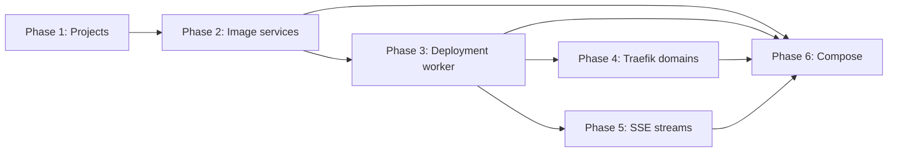

# Ignitify Core Platform Implementation Plan

## Overview

Build single-host Linux Docker PaaS in six independently verifiable slices. Axum validates and submits desired state. SQLite holds durable truth. One bounded worker owns Docker, Compose, ingress, observed-state reconciliation, events, and logs.

Design: `thoughts/shared/designs/2026-07-31T13-56-17_ignitify-core-platform.md`.

## Desired End State

Authenticated users create owned projects with one `production` environment; owner/editor configures digest-pinned image services and encrypted variables; worker deploys, stops, and rolls back managed images; Traefik serves validated domains; SSE replays durable event/log history; hardened prebuilt-image Compose workloads reuse same lifecycle.

## What We're NOT Doing

- Git, buildpacks, Dockerfile builds, registries, webhooks, preview deployments.
- Remote hosts, Docker Swarm, Kubernetes, Windows/Docker Desktop.
- Teams, SSO, API keys, SCIM, external KMS.
- Database templates, backups, schedules, monitoring, alerts, terminal/PTY.
- Path/wildcard domains, custom certificates, DNS-01, manual Traefik config, blue/green/canary.
- Resource selection, multi-host scheduling, Postgres/HA.
- Compose builds, bind mounts, host ports, plugins, external networks/volumes, privileged/kernel controls.

## Dependency Graph



Phase 4 and Phase 5 may run in parallel after Phase 3. Both edit project-detail frontend surface; merge integration must resolve that overlap. Phase 6 starts after Phase 2 through Phase 5 land.

## Runtime Contracts And Prerequisites

- `IGNITIFY_JWT_SECRET` is runtime-only and required for every process; it is never read from `.env` or compiled into the binary. `IGNITIFY_SECRETS_AGE_IDENTITY` enables service, deployment, domain, and stream capability. Without it, auth, projects, dashboard, and database health remain available while capability routes fail closed with `503`.
- Docker and Compose availability are worker capability prerequisites, not HTTP startup prerequisites. `/health` reports database readiness; authenticated runtime status reports worker/runtime availability.
- Runtime adapters receive only control-plane `RuntimeDeployment` and `RuntimeLog` DTOs. They must not depend on `ignitify-db` or accept persistence records, ciphertext, or repositories.
- Deployment retry is explicit, not automatic. On an uncertain runtime API outcome, the worker inspects deterministic managed runtime identity before deciding state. Observed failures are terminal `failed`; a caller submits a new deployment with a new idempotency key to retry. No attempt counter, retry deadline, or background backoff exists in this delivery.
- Compose mutation runs host-independent structural and policy preflight before storage. Worker-time Docker canonicalization remains a second validation pass because it requires the configured Docker executable and daemon.

## Phase 1: Workspace Authorization and Real Projects

### Overview

Create workspace ownership boundary and replace project/dashboard fixtures with live project data. This phase lands first. Later resources rely on project membership and default environment.

### Changes Required

#### 1. Domain and workspace persistence

**Files**:
- `Cargo.toml`
- `crates/ignitify-domain/Cargo.toml`
- `crates/ignitify-domain/src/lib.rs`
- `crates/ignitify-db/migrations/0002_workspace.sql`
- `crates/ignitify-db/src/lib.rs`

**Changes**:
- Add dependency-free `ignitify-domain` crate for UUID ID wrappers, `ProjectInput`, project summaries, membership roles, validation, and input errors. Domain crate has no SQL, Axum, Docker, Traefik, crypto, or filesystem types.
- Validate project name after trim: length `1..=100`, no control characters. Model `owner`, `editor`, `viewer` membership roles.
- Add additive workspace schema: `projects`, `project_members`, and `environments`, indexes from design, and one default-environment partial unique index.
- In one database transaction, create project, requesting actor owner membership, immutable default `production` environment, and audit row. Do not add project deletion or environment CRUD.
- Configure SQLite `foreign_keys=ON`, `journal_mode=WAL`, `synchronous=FULL`, `busy_timeout=5000`. Keep in-memory tests single connection.
- Add project/environment repository accessors. Authorization lookup uses actor and resource relationship; inaccessible project returns absence so core maps it to `404`.

#### 2. HTTP composition and project API

**File**: `crates/ignitify-core/src/main.rs`

**Changes**:
- Clone `Database` before `AuthService::new` and retain it in `AppState`.
- Replace auth-only error adapter with internal `ApiError` mapping auth/domain/database errors without server internals.
- Centralize bearer authentication in `require_actor(&AppState, &HeaderMap)`; preserve existing auth routes.
- Add `/api/v1` project routes: `GET /projects`, `POST /projects`, `GET /projects/:project_id`, and `PATCH /projects/:project_id`.
- Require `X-Ignitify-Request: 1` and validate allowed `Origin` when present for browser mutations. `401` unauthenticated, `404` inaccessible project, `403` insufficient role, `400` invalid input, `409` duplicate natural name.
- Keep handlers thin: extract actor, validate input, call repository, map error, return DTO.

#### 3. Frontend live project control surface

**Files**:
- `frontend/src/lib/api/core.ts`
- `frontend/src/lib/api/projects.ts`
- `frontend/src/lib/types.ts`
- `frontend/src/composables/useProjects.ts`
- `frontend/src/composables/useProject.ts`
- `frontend/src/views/ProjectsView.vue`
- `frontend/src/views/ProjectDetailView.vue`
- `frontend/src/views/DashboardView.vue`

**Changes**:
- Add mutation request header to shared API transport for same-origin non-GET requests; retain auth-specific behavior.
- Define project DTOs and dedicated project API module.
- Create named Composition API composables with `{ data, loading, error }` state and create/update actions.
- Replace `ProjectsView` fixtures with loading, error, empty, and list states; New Project uses accessible shadcn-vue Dialog and routes to created project.
- Replace project detail fixture header/overview with server project/default environment data. Show explicit service/deployment empty state. Remove fake deploy action and fake activity.
- Dashboard shows accessible project count or zero state. Do not show synthetic workload health.

### Success Criteria

#### Automated Verification

- [x] Add in-memory database test: project bootstrap creates exactly one owner and one `production` environment.
- [x] Add repository authorization test: non-member lookup returns inaccessible, owner rename succeeds, duplicate name returns conflict.
- [x] Add core handler tests: no bearer returns `401`; non-member returns `404`; viewer mutation returns `403`; project create response includes default environment.
- [x] Add frontend composable/view test covering loading, error, empty, and successful New Project redirect.
- [x] `cargo fmt --all -- --check` passes.
- [x] `cargo test --workspace` passes.
- [x] `cargo clippy --workspace --all-targets -- -D warnings` passes.
- [ ] `cd frontend && pnpm check && pnpm build` passes.

#### Manual Verification

- [ ] Sign in, create project, and land on its detail route.
- [ ] Confirm only user-owned/member projects appear and production environment displays.
- [ ] Confirm viewer cannot rename project; no inaccessible project name leaks.
- [ ] Confirm dashboard contains no static workload or health metrics.

---

## Phase 2: Image Service Configuration and Encrypted Variables

### Overview

Add image-service desired configuration and encrypted variables. Nothing starts in this phase. Requires Phase 1 workspace authorization.

### Changes Required

#### 1. Validated service data and persistence

**Files**:
- `crates/ignitify-domain/src/lib.rs`
- `crates/ignitify-db/migrations/0003_services.sql`
- `crates/ignitify-db/src/lib.rs`

**Changes**:
- Add `ServiceKind::{Image, Compose}` and validated `ServiceSpec::Image`; enable Compose create/update only in Phase 6 after mutation-time structural/policy preflight is added.
- Require lower-case DNS-label service name, exact OCI `@sha256:` digest with 64 hexadecimal characters, optional internal port `1..=65535`, optional exec-form healthcheck argv, and unique variables.
- Add `services` and `service_variables` schema. Store validated desired spec JSON and armored ciphertext only.
- Add service/variable repositories scoped by authorized project membership. Deserialize `desired_spec_json` to `ServiceSpec` at repository boundary.
- Service update validates whole config and transactionally increments `desired_generation`.

#### 2. Private secret cipher and service endpoints

**Files**:
- `crates/ignitify-control-plane/Cargo.toml`
- `crates/ignitify-control-plane/src/lib.rs`
- `crates/ignitify-core/src/main.rs`

**Changes**:
- Create private age cipher in control plane. Require `IGNITIFY_SECRETS_AGE_IDENTITY` whenever service mutation/deployment capability is enabled; derive recipient from identity.
- Encrypt every variable at rest, including non-secret variables. Decrypt only inside control-plane memory and zero temporary buffers.
- Add list/create/get/update service routes from API contract. Owner/editor may configure; viewer remains read-only.
- Authorize GET detail and return secrets only as key plus `is_set`; do not include secret values. Non-secret values may return only to owner/editor.
- Record `service.create` and `service.update` audit entries using actor and resource identifiers only. No plaintext variable values in responses, audit details, errors, labels, events, or logs.

#### 3. Image-service configuration UX

**Files**:
- `frontend/src/lib/api/services.ts`
- `frontend/src/composables/useService.ts`
- `frontend/src/components/project/ProjectServiceList.vue`
- `frontend/src/components/project/ServiceDialog.vue`
- `frontend/src/views/ProjectDetailView.vue`

**Changes**:
- Add service API module and named `useService` composable.
- Replace fixture service props with API records.
- Add accessible service dialog/form: service name, exact digest image, internal port, optional argv healthcheck, variable key/value rows, and secret toggle.
- Reject non-exact image digests in client validation and render mapped server validation result.
- Settings edits desired configuration only. Do not imply running state or public URL.

### Success Criteria

#### Automated Verification

- [x] Add domain validation tests for bad service names, missing digest, invalid ports, invalid health argv, and duplicate variable keys.
- [x] Add cipher test proving generated ciphertext excludes plaintext.
- [x] Add API serialization test proving secret DTO contains no value field.
- [x] Add repository authorization/audit test: viewer cannot read values or mutate; secret plaintext does not enter audit record.
- [x] Add frontend form test for digest-only images and secret input masking.
- [x] `cargo fmt --all -- --check` passes.
- [x] `cargo test --workspace` passes.
- [x] `cargo clippy --workspace --all-targets -- -D warnings` passes.
- [ ] `cd frontend && pnpm check && pnpm build && pnpm test` passes.

#### Manual Verification

- [ ] Owner/editor creates and edits image service using digest reference.
- [ ] Viewer sees service summary but cannot expose or mutate variables.
- [ ] Reload service detail and confirm secret presents only configured state, not prior value.
- [ ] Confirm no deployment starts and UI does not present runtime status.

---

## Phase 3: Durable Image Deployment Worker

### Overview

Create durable deployment state machine, one-worker image runtime, idempotent deploy/stop/rollback API, and history UI. Requires Phase 2 desired service configuration. No public ingress yet.

### Changes Required

#### 1. Deployment state and durable repositories

**Files**:
- `Cargo.toml`
- `crates/ignitify-domain/src/lib.rs`
- `crates/ignitify-db/migrations/0004_deployments.sql`
- `crates/ignitify-db/src/lib.rs`

**Changes**:
- Add first-use workspace dependencies only: Bollard, Tokio sync/process, `time`, `tracing`, `age`, and `zeroize`/`secrecy` only where implementation needs each.
- Model states `queued`, `preparing`, `running`, `healthy`, `failed`, `stopping`, `stopped`, `superseded`; reject invalid transitions.
- Add immutable deployment snapshot, `deployments`, `deployment_events`, and `deployment_logs` schema/indexes. Initial queued row/event share one transaction.
- Enforce one active `queued|preparing|running` deployment per service. Same service/idempotency key returns original row; different active request returns `409`.
- Add cursor-based history, event, log, atomic claim, rollback generation, and retention repository methods. Limit initial history page to 50, maximum 100.

#### 2. Control plane, worker, and Docker adapter

**Files**:
- `crates/ignitify-control-plane/src/lib.rs`
- `crates/ignitify-runtime-docker/Cargo.toml`
- `crates/ignitify-runtime-docker/src/lib.rs`

**Changes**:
- Add `ControlHandle` for durable submission/read operations plus best-effort bounded `mpsc` wake. Queue is not source of truth.
- On submission: authorize/load service, validate spec, decrypt/re-encrypt variable snapshot, zero buffers, transactionally store deployment/queued event/audit row, `try_send` wake, return accepted row.
- Spawn one worker only when deployment capability is configured, before `axum::serve`. It scans queued/nonterminal deployments at startup and every 30 seconds, atomically claims `queued -> preparing`, and reconciles observed state after uncertain Docker errors. Core auth/project startup does not require Docker or age configuration.
- Define runtime ports with control-plane `RuntimeDeployment` and `RuntimeLog` DTOs; runtime adapters do not depend on `ignitify-db` or accept persistence records/ciphertext. Keep Docker types inside runtime crate. Pull digest, create deterministic `ignitify-svc-<service-uuid>-g<generation>` container, start, inspect, attach logs, stop/remove prior owned generation only after successor reaches observed running/healthy.
- Enforce image runtime restrictions: no host ports/network/PID/IPC/UTS, privileged mode, devices, Docker socket, arbitrary mounts, or tenant labels; fixed CPU, memory, PID, and no-new-privileges defaults.
- Apply only `com.ignitify.managed=true`, opaque service ID, and generation labels. Garbage collection verifies both managed label and matching service ID.
- Mark `healthy` only from passing configured Docker exec healthcheck; no healthcheck means observed running is success. Inspect after uncertain calls; observed failures are terminal, and retry is a new explicit deployment submission rather than a worker retry loop.
- Write lifecycle/log records before broadcast. Bound lines to 16 KiB, retain latest 10,000 per deployment, prune terminal events/logs after 30 days.

#### 3. Deployment HTTP and control UI

**Files**:
- `crates/ignitify-core/src/main.rs`
- `frontend/src/lib/api/deployments.ts`
- `frontend/src/composables/useDeployment.ts`
- `frontend/src/components/project/ProjectDeploymentTimeline.vue`
- `frontend/src/views/ProjectDetailView.vue`

**Changes**:
- Compose control handle/runtime adapter in startup. Add deploy, deployment list/detail, rollback, and stop routes.
- Require `Idempotency-Key` for deploy: visible ASCII, length `1..=128`. Return `202` after durable accepted submission.
- Extend health endpoint with database and Docker readiness without exposing endpoint configuration.
- Replace fixture timeline with paginated durable history and terminal/active labels.
- Deploy action disables only until submission accepted; then select/route to returned deployment. Display observed failure state and allow a new explicit deployment submission. No fake timeout and no public URL before Phase 4.

### Success Criteria

#### Automated Verification

- [x] Add state-machine test for allowed and rejected transitions.
- [x] Add repository test: idempotent retry returns same row; competing active key conflicts; rollback creates a new generation from immutable historical spec.
- [x] Add control-plane fake-runtime test: `queued -> preparing -> running`, event order, and restart scan recovery.
- [ ] Add opt-in `IGNITIFY_DOCKER_TEST=1` integration: deploy digest-pinned tiny HTTP image without host port, assert managed labels/restrictions, remove it.
- [x] Normal tests pass without Docker daemon.
- [x] `cargo fmt --all -- --check` passes.
- [x] `cargo test --workspace` passes.
- [x] `cargo clippy --workspace --all-targets -- -D warnings` passes.
- [ ] `cd frontend && pnpm check && pnpm build && pnpm test` passes.

#### Manual Verification

- [ ] Submit deploy, restart control-plane process during nonterminal state, and confirm reconciliation resumes from SQLite.
- [ ] Submit same idempotency key twice and receive same deployment; submit distinct key while active and receive conflict.
- [ ] Stop then rollback a prior deployment and confirm history stays immutable.
- [ ] Confirm UI reports internal runtime state only; no domain URL exists.

---

## Phase 4: Traefik Domains and Managed TLS Ingress

### Overview

Attach validated root hostnames to image services through operator-owned Traefik configuration and generated labels. Requires Phase 3. May run parallel with Phase 5.

### Changes Required

#### 1. Domain model, repository, and ingress adapter

**Files**:
- `crates/ignitify-domain/src/lib.rs`
- `crates/ignitify-db/migrations/0005_domains.sql`
- `crates/ignitify-db/src/lib.rs`
- `crates/ignitify-ingress-traefik/Cargo.toml`
- `crates/ignitify-ingress-traefik/src/lib.rs`
- `crates/ignitify-runtime-docker/src/lib.rs`

**Changes**:
- Add `DomainName` validation and domain records. Accept lower-case ASCII FQDN only; reject wildcard, scheme, slash, port, path, `localhost`, private/public IP, and public-suffix-only hostname.
- Add domains schema/repository with `pending|active|failed`, hostname uniqueness, and error field.
- Add ingress port implementation that renders only platform-owned Traefik labels from opaque service IDs, hostname, fixed entrypoint/cert resolver, and selected internal port.
- Runtime connects managed image container to `ignitify-proxy` only when domain exists and recreates container when immutable route labels change. Reconcile route only after runtime inspection.
- Prevent raw user labels, router/service/middleware/TLS options, network choice, or arbitrary ports from entering ingress/runtime adapter.

#### 2. Operator artifact and domain API

**Files**:
- `crates/ignitify-core/src/main.rs`
- `infra/traefik/compose.yaml`
- `infra/traefik/traefik.yaml`

**Changes**:
- Compose ingress adapter in core and add domain list/create/delete routes.
- Domain deletion requires `{ "confirm_hostname": "..." }`, appends `domain.remove_requested`, returns `202`, and queues safe reconciliation.
- Provide operator-owned Traefik/socket-proxy deployment artifact: Docker provider at restricted read API endpoint, `exposedByDefault=false`, managed-label constraint, `ignitify-proxy`, persistent ACME storage, internal-only dashboard/API, staging/production resolver selection.
- Pin operator image digests, use read-only root filesystem, no-new-privileges, restricted Docker mutation path, and persistent `acme.json` mode `0600`.

#### 3. Managed domains UI

**Files**:
- `frontend/src/lib/api/domains.ts`
- `frontend/src/components/project/ServiceDomainsPanel.vue`
- `frontend/src/views/ProjectDetailView.vue`

**Changes**:
- Add domain API module and Domains section: hostname add, `pending|active|failed` display, HTTPS link only for active state.
- Remove action needs typed hostname confirmation.
- Explain managed TLS state without exposing Traefik dashboard/API or raw labels.

### Success Criteria

#### Automated Verification

- [x] Add domain validator tests for valid ASCII FQDN and rejected wildcard, URL, path, port, IP, localhost, and malformed labels.
- [x] Add label renderer test asserting only generated `traefik.*` labels, fixed proxy network, correct port, and no secret source.
- [x] Add policy test rejecting tenant `traefik.*` input before runtime adapter.
- [ ] Add opt-in Docker/Traefik integration asserting private-network label discovery. ACME test uses staging only.
- [x] `cargo fmt --all -- --check` passes.
- [x] `cargo test --workspace` passes without production certificate request.
- [x] `cargo clippy --workspace --all-targets -- -D warnings` passes.
- [ ] `cd frontend && pnpm check && pnpm build && pnpm test` passes.

#### Manual Verification

- [ ] On isolated Linux host, create proxy network and deploy operator artifact with staging resolver.
- [ ] Point DNS at host, add domain, and confirm route becomes active only after runtime/route reconciliation.
- [ ] Confirm dashboard/API and Docker socket proxy are not publicly exposed.
- [ ] Remove domain using exact typed confirmation; verify route reconciles away.

---

## Phase 5: Durable Realtime Events and Log Streaming

### Overview

Expose durable lifecycle events and logs via authenticated fetch-based SSE. Requires Phase 3. May run parallel with Phase 4; coordinate shared project-detail edits.

### Changes Required

#### 1. Durable replay and SSE backend

**Files**:
- `crates/ignitify-control-plane/src/lib.rs`
- `crates/ignitify-db/src/lib.rs`
- `crates/ignitify-core/src/main.rs`

**Changes**:
- Add `tokio-stream` only if required by Axum stream adapters.
- Worker commits event/log batches to SQLite before bounded control-plane broadcast. Sanitize failure strings. Never emit variables, secrets, command environments, or raw errors containing sensitive material.
- Add cursor replay/retention repository queries keyed by `(deployment_id, sequence)`.
- Add authorized SSE event/log routes. Authenticate project access before cursor lookup; unauthorized resource remains `404`.
- Parse non-negative `Last-Event-ID`, otherwise `after`. Subscribe before durable replay, replay through stable max sequence, advance the cursor before queueing lag catch-up records, and dedupe subsequent broadcast records.
- Send SSE `id`, `event`, JSON `data`, 15-second heartbeat comments, `Content-Type: text/event-stream`, `Cache-Control: no-store`, `X-Accel-Buffering: no`.
- Expired cursor returns `snapshot` deployment read model plus current sequence then continues live.

#### 2. Fetch-SSE API and deployment stream UI

**Files**:
- `frontend/src/lib/api/core.ts`
- `frontend/src/composables/useDeploymentStream.ts`
- `frontend/src/components/project/ProjectDeploymentTimeline.vue`
- `frontend/src/components/project/DeploymentLogsPanel.vue`
- `frontend/src/views/ProjectDetailView.vue`

**Changes**:
- Add `apiOpenEventStream()` using existing memory-only bearer token; do not use native `EventSource` or JSON `apiFetch` parser.
- Add named `useDeploymentStream(deploymentId)` owning AbortController, incremental SSE parser, last sequence, dedupe, capped exponential reconnect, and `onUnmounted` cleanup.
- Update timeline from lifecycle events. Add compact log panel with stdout/stderr/system filters, tail behavior, reconnect state, and retention notice.
- Subscribe only when deployment/log tab is visible. Keep `MainLayout` free of resource polling/subscriptions.

### Success Criteria

#### Automated Verification

- [ ] Add SSE handler tests: ordered replay, reconnect after cursor, unauthorized `404`, lagged broadcast durable catch-up, and heartbeat with no data leak.
- [x] Add frontend parser/composable test: reconnect dedupes sequence IDs and unmount/route-change aborts active request.
- [x] Add bounded-retention fixture test for 10,000 lines; service list uses batched variable loading rather than one variable query per service.
- [x] `cargo fmt --all -- --check` passes.
- [x] `cargo test --workspace` passes.
- [x] `cargo clippy --workspace --all-targets -- -D warnings` passes.
- [ ] `cd frontend && pnpm check && pnpm build && pnpm test` passes.

#### Manual Verification

- [ ] Open deployment timeline/log tabs, sever network, then reconnect; confirm persisted entries replay once and in order.
- [ ] Navigate away and confirm active stream request aborts.
- [ ] Test cursor older than retention and confirm snapshot arrives before live stream.
- [ ] Inspect events/logs and browser network payloads for secret absence.

---

## Phase 6: Hardened Docker Compose Service

### Overview

Add strict prebuilt-image Compose runtime after image, domain, and SSE paths prove shared lifecycle. Requires Phase 2 through Phase 5. No separate deploy/domain/realtime UI tree.

### Changes Required

#### 1. Compose service contract and runtime adapter

**Files**:
- `Cargo.toml`
- `crates/ignitify-domain/src/lib.rs`
- `crates/ignitify-runtime-compose/Cargo.toml`
- `crates/ignitify-runtime-compose/src/lib.rs`
- `crates/ignitify-control-plane/src/lib.rs`
- `crates/ignitify-core/src/main.rs`

**Changes**:
- Add first-use bounded YAML parser dependency `yaml-rust2` only for raw YAML preflight. Add Compose `ServiceSpec` and select Compose runtime through existing control-plane ports.
- On service create/update, enforce host-independent preflight ceilings: document at most 1 MiB, nesting at most 64, services at most 100. Reject aliases, anchors, merges, custom tags, duplicate keys, non-exact image digests, build, published ports, namespace modes, privileged mode, capabilities, devices, GPUs, Docker socket, arbitrary binds, `volumes_from`, external networks/volumes, driver options, raw Traefik labels, `include`, `extends`, profiles, `.env`, `env_file`, `label_file`, external config, and external secrets paths.
- Stage source and generated env in platform-owned per-service/deployment directory with restrictive permissions.
- Use fixed absolute Docker executable with `tokio::process::Command`, trusted cwd, `env_clear`, no shell, no tenant executable selection.
- Canonicalize only with fixed argv:

```text
docker compose --project-directory <stage> --project-name <opaque-id> \
  --file <stage>/compose.yaml --env-file <stage>/ignitify.env \
  config --format json
```

- Validate canonical JSON before and after adding Ignitify-generated override, then execute only fixed `docker compose ... up --detach --no-build --remove-orphans` argv. Stream `docker compose logs` through fixed argv after start while preserving stream attribution when available.

#### 2. Compose configuration UX

**Files**:
- `frontend/src/components/project/ServiceDialog.vue`
- `frontend/src/views/ProjectDetailView.vue`

**Changes**:
- Add separate Compose service path in existing dialog: YAML editor, exposed service selection, internal port/domain, and variables.
- Show policy failures by field/path. State strict supported subset; do not claim full Compose support.
- Reuse deployment history, domains, and SSE panels from prior phases.

#### 3. Hostile policy fixtures

**Files**:
- `crates/ignitify-runtime-compose/tests/fixtures/*`

**Changes**:
- Add safe one-web-service and safe named-volume fixtures.
- Add malicious fixture for every rejected class: build, port, bind, namespace, privilege/capability/device/GPU, socket, external resource, driver option, raw Traefik label, forbidden YAML mechanism, oversized/deep structural input.

### Success Criteria

#### Automated Verification

- [x] Fixture suite accepts safe single web service and safe named volume.
- [x] Fixture suite rejects listed host-escape and `traefik.*` label forms covered by canonical policy tests.
- [x] Fixed Compose argv order, cleared environment, trusted stage cwd, and canonicalization-before-`up` behavior implemented; argv order has self-check coverage.
- [ ] Add fake Docker executable test asserting exact argv, cleared environment, trusted stage cwd, no shell, and canonicalization before `up`.
- [ ] Add opt-in `IGNITIFY_DOCKER_TEST=1` integration: deploy safe Compose fixture, assert no published port and generated managed router labels, then teardown project.
- [x] Normal test suite does not require Docker daemon or production Traefik/ACME.
- [x] `cargo fmt --all -- --check` passes.
- [x] `cargo test --workspace` passes.
- [x] `cargo clippy --workspace --all-targets -- -D warnings` passes.
- [ ] `cd frontend && pnpm check && pnpm build && pnpm test` passes.

#### Manual Verification

- [ ] Create valid Compose service and verify existing deployment, domain, event, and log UI reflects it.
- [ ] Submit each high-risk setting and confirm client/server policy rejection before Docker execution.
- [ ] Inspect staging cleanup and logs; confirm no generated environment secret remains after lifecycle cleanup.
- [ ] Verify selected service only joins proxy network and receives generated route labels.

---

## Testing Strategy

### Automated

- Each phase adds focused domain, repository, handler/control-plane, and frontend regression coverage described in its success criteria.
- Exercise authorization at route and repository boundaries. Do not test only admin happy path.
- Exercise transaction boundaries: project bootstrap, snapshot plus queued event, idempotency collision, worker claim, rollback generation, and retention pruning.
- Secret scans cover JSON, audit details, generated labels, events, logs, errors, and Compose artifacts after cleanup.
- Docker/Traefik suites are opt-in with `IGNITIFY_DOCKER_TEST=1` on isolated Linux host. Normal CI uses fake runtime/ingress ports.
- Final normal gate:

```sh
cargo fmt --all -- --check
cargo test --workspace
cargo clippy --workspace --all-targets -- -D warnings
cd frontend && pnpm check && pnpm build && pnpm test
```

### Manual Testing Steps

1. Back up `data/ignitify.db`; apply migrations forward only. Verify existing auth data survives.
2. Generate age identity outside repository/image. Configure protected `IGNITIFY_SECRETS_AGE_IDENTITY`; confirm mutations fail closed without it.
3. On isolated Linux host, configure private Docker endpoint and worker permissions. Run image deploy/stop/rollback and restart recovery checks.
4. Create `ignitify-proxy`; deploy Traefik/socket restriction artifact; use ACME staging with `acme.json` mode `0600`; point DNS before production resolver switch.
5. Validate SSE reconnect/cursor-expiry behavior and secret-free replay.
6. Run Compose safe and hostile fixtures, then opt-in Compose integration. Confirm no host port, host escape, or raw Traefik control.

## Performance Considerations

- HTTP validates, writes one transaction, signals worker, returns `202`; it never waits on image pull, container creation, health, ingress, or logs.
- SQLite WAL enables readers during worker writes. `FULL` sync favors durable transitions. One worker limits write contention.
- Project lists use summary read models; service lists batch-load variables rather than issuing one query per service.
- Event/log replay uses indexed cursor range `(deployment_id, sequence)`, not offset scans. Retention bounds storage and replay.
- Broadcast reduces latency only. SQLite replay provides correctness after lag.
- One deployment command at a time intentionally favors predictable host usage. Add configurability only after measured need.
- Exact SHA-256 image references make deploy/rollback reproducible. Compose mutation preflight bounds storage-time parser cost; worker canonicalization remains a deployment-time defense in depth.

## Migration Notes

- Add migrations after `0001_auth.sql`; never edit existing migration on installed systems.
- Back up `data/ignitify.db` before Phase 1. Workspace tables are new; auth rows require no rewrite.
- Service mutation/deployment fails closed without age identity; plaintext storage is forbidden.
- Phase 3 requires Linux Docker Engine, private endpoint, worker permission, capacity, and `IGNITIFY_DOCKER_HOST`. Do not import unmanaged containers.
- Phase 4 requires `ignitify-proxy`, restricted Traefik Docker read path, persistent encrypted backup of mode-`0600` ACME state, staging test before production certificates.
- SQLite migration rollback is backup restore, not ad hoc `DROP TABLE`. Stop new binary before restoring database backup.
- Fixture frontend surfaces switch to live API only when matching backend phase lands.

## References

- Design: `thoughts/shared/designs/2026-07-31T13-56-17_ignitify-core-platform.md`
- Research: `thoughts/shared/research/2026-07-31T13-09-03_ignitify_core_architecture.md`
- Current API composition: `crates/ignitify-core/src/main.rs`
- Current auth contract: `crates/ignitify-auth/src/lib.rs`
- Current database pattern: `crates/ignitify-db/src/lib.rs`
- Current frontend API transport: `frontend/src/lib/api/core.ts`
- Current project surfaces: `frontend/src/views/ProjectsView.vue`, `frontend/src/views/ProjectDetailView.vue`
