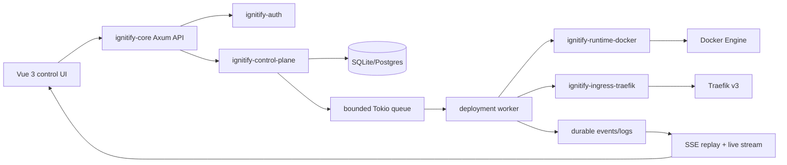

# Research: Ignitify Core Architecture

## Research Question
Define architecture guidance for Ignitify, a Rust and Vue self-hosted deployment platform similar to Dokploy. Map Dokploy features, select practical Rust dependencies, and choose ingress architecture with emphasis on fast, correct deployment reconciliation.

## Summary
Ignitify should start as a single-host Docker control plane with a Rust API, durable SQLite state, one bounded deployment worker, Docker Engine adapters, and Traefik v3 as ingress. Driver chose Traefik v3 and support for both OCI image deployments and Docker Compose workloads in first deployable MVP.

Rust improves control-plane correctness and resource cost, but proxy choice is not primary performance lever. Fast user-visible deployment depends on short API work, queued idempotent reconciliation, Docker API usage, durable event/log cursors, and reconnectable SSE. Traefik is selected because Docker discovery, ACME, TLS, HTTP/2, WebSocket, and telemetry work without Ignitify owning an xDS or certificate control plane.

Current Ignitify has only Axum auth routes, SQLite auth persistence, static dashboard, and projects placeholder. Deployment, Docker, proxy, server, source-provider, and job domains do not exist yet.

## Decisions

- Ingress MVP: Traefik v3.
- Runtime MVP: OCI image deployment and Docker Compose deployment.
- Platform model: one Ignitify control-plane process and one local Docker Engine host first.
- Deployment execution: bounded durable worker, not HTTP request handler.
- Realtime: durable events/logs plus SSE; WebSocket reserved for terminal/interactive attach.
- Persistence: SQLite with WAL for one host; Postgres migration only when multi-process, multi-host, or HA requirements arrive.

## Dokploy Feature Map

Dokploy currently combines a Next.js dashboard, Hono deployment API, PostgreSQL/Drizzle persistence, Docker/Swarm execution, Traefik ingress, Inngest deployment events, BullMQ/Redis schedules, and Go monitoring agent. It supports projects, environments, applications, Compose/Stacks, databases, Git providers, deploy/build servers, domains, certificates, logs, terminals, backups, previews, webhooks, notifications, and permission tiers.

Useful lessons:

- Application and Compose execution differ. Keep runtime adapters separate.
- Deployment concurrency is per server and service; worker queue must serialize same-service deployment.
- Domain/TLS routes are deterministic desired-state reconciliation, not incidental shell commands.
- Logs must have durable cursor/replay. Filesystem paths alone break client reconnect, remote operation, and cleanup.
- Current Dokploy security fixes around shell injection and cross-organization access show that Compose, Git, and authorization are trust boundaries.

Sources:

- Dokploy architecture: https://docs.dokploy.com/docs/core/architecture
- Dokploy repository: https://github.com/Dokploy/dokploy/tree/canary
- Dokploy application service: https://github.com/Dokploy/dokploy/blob/canary/packages/server/src/services/application.ts
- Dokploy Compose service: https://github.com/Dokploy/dokploy/blob/canary/packages/server/src/services/compose.ts
- Dokploy Traefik generation: https://github.com/Dokploy/dokploy/tree/canary/packages/server/src/utils/traefik

## Current Ignitify Boundary

Current Rust workspace auto-discovers three crates through `Cargo.toml:1-2`:

- `ignitify-core`: Axum process startup, routes, cookie handling, HTTP error mapping at `crates/ignitify-core/src/main.rs:21-235`.
- `ignitify-auth`: Argon2/JWT/refresh-session service at `crates/ignitify-auth/src/lib.rs:137-305`.
- `ignitify-db`: SQLite migration and auth repositories at `crates/ignitify-db/src/lib.rs:39-82`.

The only schema is users, refresh tokens, and audit logs in `crates/ignitify-db/migrations/0001_auth.sql:3-36`. Dashboard metrics are hardcoded in `frontend/src/views/DashboardView.vue:6-10`; `ProjectsView` is empty and create action is disabled in `frontend/src/views/ProjectsView.vue:13-27`.

## Target Architecture



### Crate Boundaries

```text
ignitify-core
  Axum composition root; HTTP validation/auth; JSON/SSE response adapters.

ignitify-domain
  Resource IDs, project/environment/service/deployment/domain models,
  state transitions, input validation. No SQL, Axum, Docker, or Traefik.

ignitify-control-plane
  Commands, bounded queue, worker/reconciliation, idempotency, lifecycle events,
  runtime and ingress ports. No Docker client types, Compose CLI, SQL, or Axum.

ignitify-runtime-docker
  Bollard Docker Engine adapter for image services. Docker status/log translation.

ignitify-runtime-compose
  Staged Compose validation, canonicalization, fixed argv `docker compose` execution,
  status/log collection. Separate due to Compose semantic/security surface.

ignitify-ingress-traefik
  Platform-owned proxy network, approved labels/config, route reconciliation,
  Traefik status translation. No user label passthrough.

ignitify-db
  Migrations, repositories, transactions, durable events/logs, secret ciphertext.
```

Dependency direction:

```text
ignitify-core -> auth, domain, control-plane, db
control-plane -> domain, db
runtime-docker -> domain/control-plane port
runtime-compose -> domain/control-plane port
ingress-traefik -> domain/control-plane ingress port
```

`ignitify-core` must not import Docker or Traefik client types. HTTP handlers authenticate, validate, persist/submit commands, return `202 Accepted`, read state, and open streams. Workers own external effects, retries, transitions, and reconciliation.

## Resource and State Model

Initial hierarchy:

```text
User -> Project -> Environment -> Service -> Deployment
                                      -> Domain
```

`Service.kind` is `image` or `compose`. Do not collapse their request/input formats, but normalize their lifecycle into a common deployment state machine.

Minimum durable tables after auth:

```text
projects
project_members
environments
services
deployments
deployment_events
deployment_logs
domains
service_secrets
```

`deployments` holds desired spec snapshot, generation, request/idempotency key, runtime reference, status, failure reason, timestamps, and initiating actor. `deployment_events` and `deployment_logs` use monotonically increasing sequence cursor per deployment. Store desired mutation and initial `queued` event in one transaction.

State transitions:

```text
queued -> preparing -> running -> healthy
queued|preparing|running -> failed
healthy -> stopping -> stopped
healthy -> superseded
```

Rules:

- Per service: one active deployment. Submit repeat deploys as coalesced desired generation or reject conflict explicitly.
- Per host: bounded concurrency; phase 1 default `1` worker command at a time.
- On process restart: query nonterminal deployments and enqueue reconciliation from stored desired state.
- Runtime/API status is observed state, never assumed from requested state.
- Deployment and domain changes are idempotent by generation plus request key.

## Runtime and Realtime Flow

1. API validates actor, project membership, service input, idempotency key, and secret references.
2. API inserts deployment snapshot and `queued` event transactionally, then submits command to `ControlHandle`.
3. Worker transitions state and calls runtime adapter.
4. Runtime adapter creates/updates container or runs controlled Compose execution.
5. Worker appends lifecycle event/log records before publishing same record to `tokio::sync::broadcast`.
6. Worker reconciles ingress only after runtime endpoint passes configured readiness policy.
7. API SSE endpoint replays records after `after=<sequence>`, then subscribes to live broadcast.
8. Browser reconnects from last sequence. Broadcast loss never loses durable history.

Use SSE for deployment progress and log tail. Use WebSocket only for future terminal attach or bidirectional agent protocol.

## Ingress Decision

### Selected: Traefik v3

Traefik is correct MVP gateway because its Docker provider watches platform-injected labels, supports automatic ACME certificates, WebSocket/gRPC, HTTP/2, Prometheus/OTLP observability, and hot dynamic route updates. Set `providers.docker.exposedByDefault=false`; only Ignitify may inject `traefik.*` labels.

Operational rules:

- Dedicated `ignitify-proxy` Docker network.
- Traefik dashboard/API internal only.
- Protect Docker API via socket proxy or narrow dedicated socket access.
- Persist ACME state; test Let’s Encrypt staging first.
- Use JSON access logs and Prometheus/OTLP metrics.
- No direct user-controlled Traefik labels, router names, middlewares, TLS options, or Docker network selection.

### Rejected for MVP

- Envoy: excellent xDS/TLS/observability but requires Ignitify-owned discovery, control plane, certificate lifecycle, and Docker translation. Use later for multi-host traffic policy/canary/mTLS needs.
- Caddy: valid simpler REST-config alternative. Less direct Docker-native fit than Traefik; adds an adapter choice.
- NGINX OSS: needs generated config/reload/cert lifecycle work. Good data plane, wrong MVP ownership cost.
- Orion Proxy: Rust/xDS-compatible research project. No verified mature Docker discovery/ACME lifecycle; not safe default.
- Pingora/Pingap: Pingora is framework, not turnkey ingress. Listener/config changes can restart and break long-lived connections; Pingap remains pre-stable. Experimental only.

Sources:

- Traefik Docker provider: https://doc.traefik.io/traefik/reference/install-configuration/providers/docker/
- Traefik ACME: https://doc.traefik.io/traefik/https/acme
- Envoy xDS: https://www.envoyproxy.io/docs/envoy/latest/intro/arch_overview/operations/dynamic_configuration
- Caddy API: https://caddyserver.com/docs/api
- Orion: https://github.com/kmesh-net/orion
- Pingora listener caveat: https://github.com/cloudflare/pingora/issues/690

## Rust Dependency Guidance

Add only when first use exists:

| Concern | Pick | Reason |
|---|---|---|
| Runtime/channels/processes | `tokio` | Existing runtime. Use bounded `mpsc`, `broadcast`, `process::Command`, timeout/cancellation. |
| Docker Engine | `bollard` | Docker API, Unix socket, BuildKit, lifecycle, logs. Keep types inside runtime crate. |
| Git | `git2` | Mature libgit2 binding. Explicit HTTPS/SSH, host-key verification, credential policy. Use `git` CLI only when compatibility requires it. |
| SQL | existing `sqlx` | SQLite now; add Postgres feature profile when multi-node need is real. No `Any`. |
| API/SSE/WebSocket | existing `axum` | Existing API framework supports SSE and future `ws` feature. |
| Metrics | `metrics` + `metrics-exporter-prometheus` | Separate platform metrics from OTel tracing. |
| Tracing | `tracing`, `tracing-subscriber`, OTLP crates | Structured events now; OTLP only with collector deployment. |
| Secret buffers | `zeroize`/`secrecy` | Prevent accidental logging/residual buffers; neither replaces encryption. |
| Encryption at rest | external KMS preferred; `age` only MVP | `age` pre-1.0 upstream beta caveat. Keep master key outside DB/image. |

Do not add a queue framework, Redis, RabbitMQ, Kubernetes controller, or generic workflow engine for first host. SQLite state plus Tokio queue solves the required phase-1 durability when startup reconciliation exists.

Sources:

- Tokio: https://docs.rs/tokio
- Bollard: https://docs.rs/bollard
- git2: https://docs.rs/git2
- SQLx: https://docs.rs/sqlx
- Axum: https://docs.rs/axum
- Metrics exporter: https://docs.rs/metrics-exporter-prometheus
- Rust OpenTelemetry maturity: https://opentelemetry.io/docs/languages/rust/

## Compose Security Policy

Docker Compose is a high-risk tenant input surface. No Rust crate currently models Compose at `docker compose` fidelity. Do not deserialize user YAML into incomplete structs, serialize it back, then execute it.

Policy pipeline:

1. Parse raw YAML with bounded YAML 1.2 parser; reject aliases, anchors, merge keys, custom tags, duplicate keys, oversize/deep input, `include`, and `extends`.
2. Stage compose file and generated environment file under platform-owned directory.
3. Run fixed argv `docker compose config --format json` with trusted `--project-directory`, `--project-name`, `--file`, and `--env-file`.
4. Validate canonical JSON against pinned Compose schema plus Ignitify policy.
5. Add platform-owned Traefik labels only after policy validation.
6. Execute fixed argv `docker compose up --detach --no-build`; no shell, user executable, or untrusted environment.

Hard reject host-escape fields: `privileged`, `cap_add`, `devices`, `device_cgroup_rules`, `gpus`, `security_opt`, `sysctls`, `runtime`, host/container/service namespace modes, `use_api_socket`, Docker socket bind, `volumes_from`, arbitrary host binds, host networking, and unmanaged published ports.

Reject all user `traefik.*` labels in `labels`, `deploy.labels`, `build.labels`, `label_file`, and anchor-expanded fields. Platform injects allowed route labels. Reject Compose build contexts for tenant workloads in first slice; prebuilt image reference only. Build pipeline is separate trust boundary.

Sources:

- Docker Compose config canonicalization: https://docs.docker.com/reference/cli/docker/compose/config/
- Compose specification: https://github.com/compose-spec/compose-spec
- Compose interpolation: https://docs.docker.com/reference/compose-file/interpolation
- Compose build specification: https://docs.docker.com/reference/compose-file/build/
- Rust Command safety: https://doc.rust-lang.org/std/process/struct.Command.html

## Delivery Ladder

### Phase 1: Control-plane foundation

- Add domain/control-plane/runtime-docker/runtime-compose/ingress-traefik boundaries.
- Add project, environment, service, deployment, event/log, domain, and encrypted-secret storage.
- Project/environment/service CRUD with membership authorization.
- Durable state machine, bounded worker, recovery/reconciliation.
- API status endpoints and SSE event/log replay.
- No Git clone/build, remote servers, database templates, backups, terminal, previews, or teams yet.

### Phase 2: First deploy

- OCI image service: image reference, environment variables, private registry credential reference, internal port, health/readiness.
- Container lifecycle through Docker Engine; append logs/events; stop/redeploy.
- Domain mapping through Traefik labels, ACME HTTP-01, proxy network.
- One deployment active per service; rollback chooses prior immutable deployment spec.

### Phase 3: Compose service

- Staged canonicalization + strict security policy.
- Prebuilt images only. No arbitrary tenant Docker build, bind mount, host ports, privileged settings, or user Traefik labels.
- Compose project status/log collection and proxy route injection.

### Phase 4: Source/build and operator capabilities

- Git/GitHub source, webhook verification, build isolation, image registry, deploy webhook.
- Metrics/alerts, backups, scheduled jobs, SSH bootstrapping or narrow Rust agent.
- Remote deployment/build servers, Postgres control plane, per-server queues.

### Phase 5: Advanced platform

- Teams/RBAC, API scopes, secret KMS integration, preview environments, database lifecycle, SSO, terminal, multi-host agent protocol, canary traffic.
- Reconsider Envoy only when distributed traffic policy/mTLS/canary features justify xDS ownership.

## Open Questions

- Single-user/home-lab only, or team/multi-tenant design from phase 1? Current auth has `tenant_id` placeholder but no membership model.
- Should initial domain support root hostname only, or hostname plus path prefixes? Path prefixes need explicit proxy/middleware policy.
- What is initial secret master-key custody: environment variable, OS secret store, or external KMS?
- Does first release need Docker Desktop/Windows support, or Linux Docker Engine only? Docker socket and Compose execution differ.
- What service resource limits and quota defaults should platform enforce?

## Source References

- `Cargo.toml:1-22` — current workspace and dependency boundary.
- `crates/ignitify-core/src/main.rs:21-235` — Axum state, auth route adapter, startup.
- `crates/ignitify-auth/src/lib.rs:34-305` — authenticated actor/session service contract.
- `crates/ignitify-db/src/lib.rs:39-82` — SQLite connection/repository access.
- `crates/ignitify-db/migrations/0001_auth.sql:3-36` — existing durable schema.
- `frontend/src/lib/api/core.ts:49-205` — browser API token/refresh flow.
- `frontend/src/router/index.ts:4-39` — protected frontend navigation.
- `frontend/src/views/DashboardView.vue:6-10` — placeholder metric state.
- `frontend/src/views/ProjectsView.vue:13-27` — placeholder project UI.
